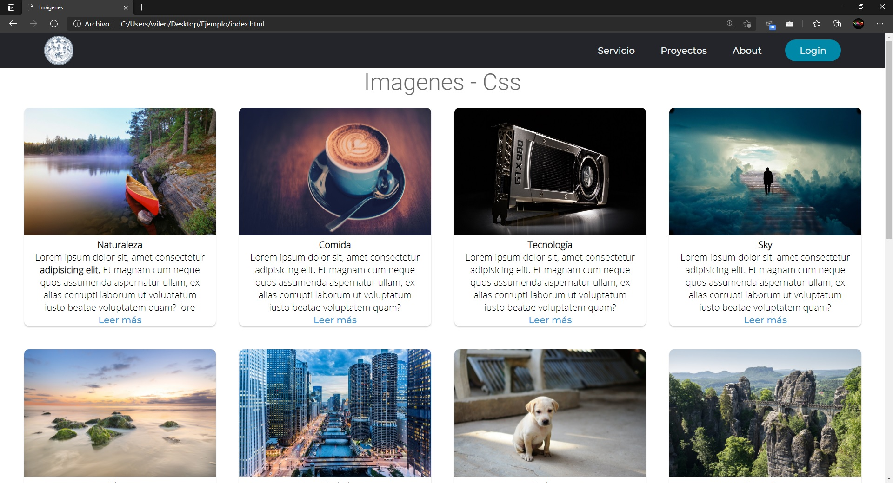

# Taller 2
## Descripción
Se realizará un sitio web sencillo para aprender los diferentes conceptos presentes en las tecnologias web de Html y Css.

## Elementos Utilizados
> ### Iconos
Importar iconos font-awesome desde bootstrapcdn:
``` Html
<link rel="stylesheet" href="https://stackpath.bootstrapcdn.com/font-awesome/4.7.0/css/font-awesome.min.css">
```

> ### Fuentes
Se utilizaron las fuentes de `Open Sans`, `Roboto`, `Montserrat`.

Importar fuentes desde google fonts:
``` Css
@import url('https://fonts.googleapis.com/css2?family=Open+Sans:wght@300&family=Roboto:wght@300&family=Montserrat:wght@500&display=swap');
```


## Vista Final




